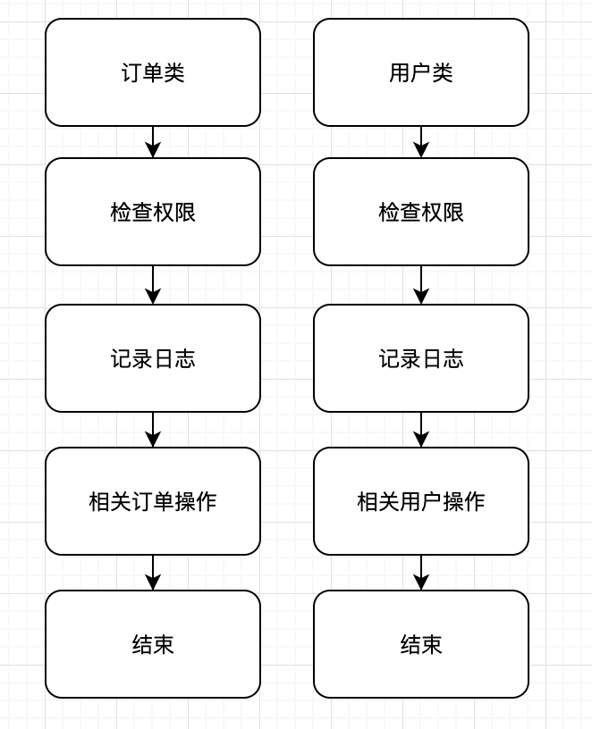
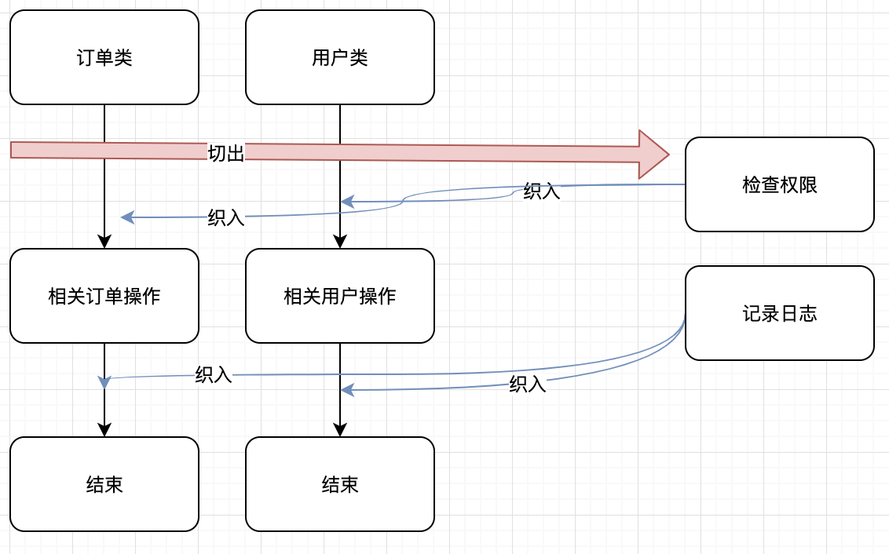

# 前言

在介绍 AOP 之前我们先来简单的说明一下，AOP 和 OOP 一样都是一种编程思想，AOP 只是 OOP 的补充和延伸，可以更方便的对业务代码进行解耦，提高代码质量，增加代码的可重用性。后面的篇章会结合实际案例，教会大家理解并学会使用 AOP。

# 场景案例

我们就从日志记录入手带领大家理解AOP切面编程的优势

首先我们假设我们有以下需求：

- 需要对某个接口做调用日志记录，记录接口的调用详情（调用参数，返回结果等）。
- 当接口调用出现异常时，做特殊处理比如记录日志、通知我们的运维小伙伴等。

如上，我们定义了一个简单的需求，接下来我们去实现他，我们先不要考虑 AOP ，就先用你所熟悉的 OOP 思想来完成以上的需求

# OOP 实现

假设我们有以下的一个业务接口

```php
<?php declare(strict_types=1);
/**
 * 订单服务类
 *
 * @since 2.0
 */
class OrderServer
{
    /**
     * 下单接口
     *
     * @param $productName //商品名字
     * @param $number //购买数量
     * @param $uid //用户id
     *
     * @return array        //订单参数
     */
    public function order($productName, $number, $uid): array
    {
        $price = 1000;
        $total = $price * $number;
        $data = [
            'product_name' => $productName,
            'price' => $price,
            'number' => $number,
            'total' => $total,
            'order_id' => uniqid($uid . time() . $total)
        ];
        return $data;
    }
}
```

在传统的 OOP 思想下，我们可能会写一个类继承于我们的 `OrderServer` 然后重写其 `order` 方法，然后在使用 `OrderServer` 类的地方，替换成我们自己定义的类。

示例代码如下：首先我们先编写一个继承于 `OrderServer` 的子类
```php
<?php declare(strict_types=1);
/**
 * Class InheritOrderServer
 *
 * @since 2.0
 */
class InheritOrderServer extends OrderServer
{
    /**
     * @param $productName
     * @param $number
     * @param $uid
     *
     * @return array
     * @throws Exception
     */
    public function order($productName, $number, $uid): array
    {
        //TODO::在这里我们记录接口调用时传过来的参数
        try {
            $result = parent::order($productName, $number, $uid);
            //TODO::这里可以处理父类方法返回的结果 然后返回结果进行后续处理
            return $result;
        } catch (Exception $e) {
            //TODO::如果有出错异常，在这里我们处理出错的日志记录等操作之后继续将异常抛出
            throw $e;
        }
    }
}
```
接下来继续，去找到我们原先调用 `OrderServer` 的地方，将原先的调用修改成我们后来该写的继承类 `InheritOrderServer` 。
```php
<?php declare(strict_types=1);
//$order = new OrderServer(); //屏蔽掉原先的旧的业务调用
$order = new InheritOrderServer();//修改为我们新继承的子类
$order->order('iPhone XR', 200, 10000);
```
至此，经过如上的操作，我们貌似也能满足了业务需求完成了日志记录的功能，但是你会发现过程及其繁杂，代码耦合严重，污染了order方法，如果旧的业务中有100处调用，那么你就要去到业务代码里面修改100处代码,如果你一直以OOP 的思想来试着解决这些问题，貌似很难办，因为几乎都是高耦合的侵入式的解决方案。

这时也许你可能会想到使用中间件，拦截器等等一些方案，但是这些其实说白了已经是基于AOP思想的设计模式了。其实 AOP 就是基于 OOP 的延伸和补充，他就是一种思想，一种设计模式。

# AOP 实现

接下来我们将基于上面的例子，引入 AOP 的概念，告诉大家，什么是AOP (what) ,如何使用AOP (how), 为什么使用AOP (why) 。

## 什么是AOP

### 定义

> 面向切面的程序设计（Aspect-oriented programming，AOP，又译作面向方面的程序设计、剖面導向程式設計）是计算机科学中的一种程序设计范型，旨在将横切关注点与业务主体进行进一步分离，以提高程序代码的模块化程度。
> --《维基百科》

> 在软件业，AOP为Aspect Oriented Programming的缩写，意为：面向切面编程，通过预编译方式和运行期动态代理实现程序功能的统一维护的一种技术。
> --《百度百科》

AOP 的主要作用就是在不侵入原有功能代码的情况下，给原有的功能添加新的功能。

我们都知道 OOP 实际上就是对我们的功能属性，方法做一个抽象封装，能够比较清晰的划分逻辑单元，但是 OOP 只能够进行纵向的抽象封装，无法很好的解决横向的重复问题，而 AOP 则很好的解决了这一问题，下面请看以下图示。



如上图我们可以看到我们有两个类 `订单类` , `用户类` 我们都相关功能做了封装，但是遇到类似 权限检查，日志记录这种重复性的操作却没有太好的办法去解决它，而 AOP 的思想就是将这些功能横向切出去，再在适当的时候将这些功能织入进来，如图



如图所示这就是 AOP 所做的功能。

AOP 和 OOP 一样是一种思想，它同 OOP 一样也有一些相关的专业术语，下面我会向大家介绍这些术语。

### 相关术语解释

首先我们先将相关术语进行一个大致的解释

* 通知（Advice）

    就是你想要的功能，用方法实现的功能，也就是上说的安全、事务、日志等。你先把功能用方法给先定义好，然后再想用的地方用一下。
    
* 连接点（JoinPoint）

    就是允许你把通知（Advice）放在的地方，基本每个方法的前、后（两者都有也行），或抛出异常是时都可以是连接点，Swoft 只支持方法级的连接点。只要记住，和方法有关的前前后后都是连接点。
    
* 切入点（Pointcut）

    这个就是定义要切入的具体的方法，为什么呢，假设一下，一个类中有10个方法，每个方法都有好多个连接点(JoinPoint),但是你并不想在所有方法都使用通知（织入），你只想织入其中的某几个方法，那么就是用这个切入点来定义具体的方法。
    
* 切面（Aspect）

    是通知（Advice）和切入点 （Pointcut）的结合。通知说明了干什么，切入点说明了在哪里干，一般情况下连接点是在指定切入点的时候就指定好了的，上面单独吧连接点写出来只是为了让其更好理解。
    
* 引入（introduction）

    就是将我们新的类和方法，用到目标类中。
    
* 目标（target）

    引入中所提到的目标类，也就是要被通知的对象，也就是真正的业务逻辑，他可以在毫不知情的情况下，被织入切面。
    
* 代理（proxy）

    整套AOP机制的，都是通过代理，Swoft 使用了 PHP-Parse 类库来更方便的实现AOP
    
* 织入（weaving）

    把切面应用到目标对象来创建新的代理对象的过程。

### 如何使用AOP
    
这里主要是介绍如何在SWOFT 中使用 AOP

在SWOFT 中使用AOP 特别的方便，我们只需要通过 `注解` 的方式来声明一个 切面类 就可以了，这里这是简单的演示，关于 AOP 类的详细声明相关的说明，请看后续  [声明](../aop/index.md) 章节。

```php
<?php declare(strict_types=1);

namespace App\Aspect;

use Swoft\Aop\Annotation\Mapping\Aspect;
use Swoft\Aop\Annotation\Mapping\Before;
use Swoft\Aop\Annotation\Mapping\PointBean;

/**
 * AOP切面类
 * 
 * @since 2.0
 *
 * 声明切面类
 * @Aspect(order=1)
 *
 * 使用注解定义切入点
 * @PointBean(include={"App\Http\Controller\TestExecTimeController"})
 */
class CalcExecTimeAspect
{
    /**
     * 定义通知链接点
     * @Before()
     */
    public function before()
    {
        //TODO::这里做具体的通知（Advice）
    }
}
```

## 使用 Swoft 的 AOP 完成上方案例

至此我们重新回顾下本章开篇提到的场景案例，这里我们使用 Swoft 框架的AOP 来快速的实现案例中的需求。

```php
<?php declare(strict_types=1);

namespace App\Aspect;

use Swoft\Aop\Annotation\Mapping\Aspect;
use Swoft\Aop\Annotation\Mapping\Before;
use Swoft\Aop\Annotation\Mapping\After;
use Swoft\Aop\Annotation\Mapping\PointBean;

/**
 * AOP切面类
 * 
 * @since 2.0
 *
 * 声明切面类
 * @Aspect(order=1)
 *
 * 使用注解定义切入点
 * @PointBean(include={"OrderServer::class"})
 */
class CalcExecTimeAspect
{
    /**
     * 定义通知链接点
     * @Before()
     */
    public function before()
    {
        //TODO::在这里我们记录接口调用时传过来的参数
    }
    
     /**
      * 定义通知链接点
      * @AfterReturning()
      */
     public function afterReturning()
     {
         //TODO::这里可以处理方法返回的结果
     }
     
     /**
       * 定义通知链接点
       * @AfterThrowing()
       */
      public function afterThrowing()
      {
          //TODO::如果有出错异常，在这里我们处理出错的日志记录等操作

      }
}
```

如上，利用AOP 我们可以很快速的完成此需求。更完整的使用案例请查看   [使用](../aop/usage.md) 章节


