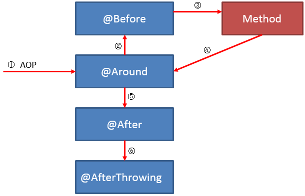
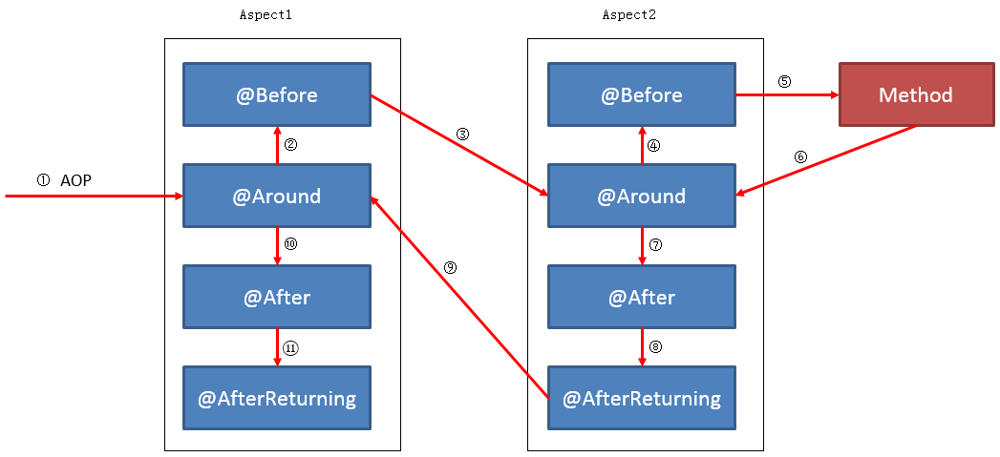

# 顺序

多个切面执行是按照 `order` 值越小越先执行，一个切面多个通知点，也是按照一定的顺序执行的。

## 单切面

一个切面顺序相对来说很简单，但是分异常和正常两种情况

### 正常顺序

1. `@Around` 通知的 before around 业务
2. `@Before` 通知
3. method 方法
4. `@Around` 通知的 after around 业务
5. `@After` 通知
6. 执行 `@AfterReturn` 通知

### 异常顺序

1. `@Around` 通知的 before around 业务
2. `@Before` 通知
3. method 方法
4. `@Around` 通知的 after around 业务
5. `@After` 通知
6. 执行 `@AfterThrowning` 通知

## 多切面

多切面已正常情况为例：

1. Aspect1 `@Around` 通知的 before around 业务
2. Aspect1 `@Before` 通知
3. Aspect2 `@Around` 通知的 before around 业务
4. Aspect2 `@Before` 通知
5. method 方法
6. Aspect2 `@Around` 通知的 after around 业务
7. Aspect2 `@After` 通知
8. Aspect2 执行 `@AfterReturn` 通知
9. Aspect1 `@Around` 通知的 after around 业务
10. Aspect1 `@After` 通知
11. Aspect1 执行 `@AfterReturn` 通知

