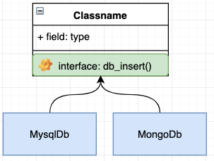

# 容器

## 前言

Swoft 基于 `PSR-11` 规范设计了自己容器，并基于 `注解` 增强了它的功能。
容器是 Swoft 最重要的一个设计，可以说是 Swoft 的核心精髓，也是 Swoft 各种模块的实现基础，本章节将会对容器的相关基础知识做一个介绍，以便新手朋友们更好的理解容器。

## 什么是容器

我们先看一下比较官方的定义

> 控制反转（Inversion of Control，缩写为IoC），是面向对象编程中的一种设计原则，可以用来减低计算机代码之间的耦合度。其中最常见的方式叫做依赖注入（Dependency Injection，简称DI），还有一种方式叫“依赖查找”（Dependency Lookup）。通过控制反转，对象在被创建的时候，由一个调控系统内所有对象的外界实体，将其所依赖的对象的引用传递(注入)给它。--《维基百科》

这里并没有说到容器，而只是说到了一个叫 `IOC` 的设计原则，还有一个叫 `DI` 依赖注入的名词，好像并没有容器的什么事情，这是为什么呢？要搞清楚这个问题首我们首先还是需要对一些专业术语进行一个解释。

##  DIP - 依赖倒置原则

依赖倒置(Dependence Inversion Principle,简称DIP，是一种抽象的软件设计原则，它主要是告诉我们一些规范我们先看下官方对于这个原则的定义

> 高层模块不应依赖于低层模块，两者应该依赖于抽象。
>
>抽象不应该依赖于实现，实现应该依赖于抽象。

具体是什么意思呢我们可以通过一个例子来说明下这个原则，大家应该都对电脑上的 USB 插口很熟悉，通过它我们可以扩展各种的外设能力，例如 U盘、游戏鼠标等等，只要接口一致，插上设备就能正常工作。


在这个例子中，我们的电脑就相当于是高层模块，而 U盘、鼠标等就相当于是底层模块。我们的电脑定义了一个插口（接口），可以供其他的设备插入使用，但是我们的电脑并不依赖于具体要插入的设备，它只是定义好了一个接口规范，只要是符合这个接口规范的设备都可以插入到这台电脑上来使用。那么对应到软件开发上来看指的就是 **依赖倒置原则转换了依赖关系，要求高层的模块不应该依赖于底层模块的实现，底层的模块要依赖于高层模块定义的接口**。

上面的例子只是说清楚了 `依赖倒置原则(DIP)` 的规范定义，下面我们再通过一个软件开发的场景例子看看为何需要设计这个原则。

场景：比如我们有一个业务需要对数据做入库操作，目标可能是 MySql、MongoDb 等。

实现一：无依赖倒置，即底层定义接口，高层模块实现。


如图就是在不实用依赖倒置的情况下，我们要完成此场景的功能非常的麻烦，我们的业务类（高层模块）要实现所有的 DB类（底层模块） 接口，如果再有新的 DB类（底层模块）介入，则又需要去修改业务类（高层模块）来实现新的 DB类（底层模块）这就破坏了类的开放封闭原则。

实现二：使用依赖倒置，即高层定义接口，底层模块实现。



如图，我们使用依赖倒置后，我们的业务类（高层模块）将不再依赖 DB类（底层模块）而是由 DB类（底层模块）负责实现业务类（高层模块）的接口，这样即使由新的底层模块加入到业务中时我们也不需要修改业务模块。

由此可见使用 DIP 的好处：

* 可以通过抽象使各个类或模块的实现彼此独立，不互相影响，实现模块间的松耦合（也是本质）；

* 可以规避一些非技术因素引起的问题（如项目大时，需求变化的概率也越大，通过采用依赖倒置原则设计的接口或抽象类对实现类进行约束，可以减少需求变化引起的工作量剧增情况。同时，发生人员变动，只要文档完善，也可让维护人员轻松地扩展和维护）；

* 可以促进并行开发（如，两个类之间有依赖关系，只要制定出两者之间的接口（或抽象类）就可以独立开发了，而且项目之间的单元测试也可以独立地运行，而TDD开发模式更是DIP的最高级应用（特别适合项目人员整体水平较低时使用））。

## IOC - 控制反转

通过上节的介绍我们清楚了DIP-依赖倒置原则，但是它只是一种 `软件设置原则`  它仅仅是为我们提供一个标准，以便我们可以遵循，避免不良的设计，但是它并不会告诉我们这些标准如何实现。

那么这里就要向大家介绍 IOC 了，它是一种 `软件设计模式` 即它为我们如何实现 DIP 提供了详细的解决方案。它的定义是：**为相互依赖的组件提供抽象，将依赖的获取交给第三方来控制，即依赖对象不在被依赖的模块中获取**。在 

[DIP - 依赖倒置原则](#DIP-依赖倒置原则) 小节中我们列举了USB插口的例子，那么 IOC 的意思通俗来理解就是，我们的电脑并没有插入具体设备的功能，而是由人为（第三方）插入来控制的。下面我们就以之前在 DIP 中的软件开发场景的例子继续深入来介绍 IOC 。

比如说我们的业务是一个订单入库的操作，在最初我们只是将数据存入到 Mysql 中，通常我们会封装一个 MysqlDb 的类用于数据库的操作

```php
/**
 * Class MysqlDb
 *
 * @since 2.0
 */
class MysqlDb
{
    public function insert()
    {
        //TODO::插入一些数据
    }
}
```
紧接着我们看一下我们的业务类
```php
/**
* Class Order
*
* @since 2.0
*/
class Order
{
    public function add()
    {
        //TODO::订单业务
        $db = new MysqlDb();//建立依赖
        $db->insert();//执行入库操作
    }
}
```
至此我们看似是完成类我们的需求，那这时如果让你改用 MongoDb 怎么办？那我们要先去写一个 MongoDb 的操作类，然后再去我们的 `Order` 类中修改 DB 的依赖，例如：
定义 Mongo Db 类
```php
/**
 * Class MongoDb
 *
 * @since 2.0
 */
class MongoDb{
    public function insert()
    {
        //TODO::插入一些数据
    }
}
```
然后我们继续修改我们的业务类
```php
/**
* Class Order
*
* @since 2.0
*/
class Order
{
    public function add()
    {
        //TODO::订单业务
//        $db = new MysqlDb();//将MysqlDb更改为MongoDb
        $db = new MongoDb();//建立依赖
        $db->insert();//执行入库操作
    }
}
```
显然这是一个非常糟糕的设计，组件之间还是高度耦合的，同时也破坏了开放封闭原则，也违背了DIP原则。高层的业务模块不应该维护依赖关系，两者应该将依赖抽象出来。那么之前说过 IOC 的出现好像就是为了解决这个问题的，那么它提供了什么方法呢？

IOC 是一个很大的概念，基于这个模式可以有很多种实现方式，但是其主流的有两种：**依赖查找(Dependency Lookup 简称DL),依赖注入(Dependency Injection 简称 DI)** ,Swoft 使用的是 `依赖注入(DI)` 技术。我们也主要对 `依赖注入DI` 进行一个说明介绍，对 `依赖查找（DL）`感兴趣的朋友可自行 Google。

## DI - 依赖注入

DI 是实现 IOC 的一种重要方式，如之前的例子所述，我们将依赖关系在业务中进行创建和绑定是非常糟糕的做法，`依赖注入DI` 就是解决这种问题，它提供一种实现方式，将需要依赖的底层模块（MysqlDb，MongoDb等）的对象的引用传递给被依赖对象（业务模块）去使用，那么它是如何实现的呢？

DI 主要是由两种方式来实现依赖注入：`构造函数注入` 、`属性注入`。

**构造函数注入**顾名思义，它就是通过对象的构造函数将所需的依赖模块传递给对象使用。下面我们来看一下例子

由于DIP 的原则，我们不应该再模块内部来创建依赖关系即**高层模块不应该依赖于底层模块，两者应该依赖于抽象**，所以我们先来定义一个接口。

```php
/**
 * Interface DbDrive
 *
 * @since 2.0
 */
interface DbDrive
{
    public function insert();
}
```

然后我们将我们的数据库类都实现这个接口

```php
/**
 * Class MysqlDb
 *
 * @since 2.0
 */
class MysqlDb implements DbDrive
{
    public function insert()
    {
        //TODO::插入一些数据
    }
}

/**
 * Class MongoDb
 *
 * @since 2.0
 */
class MongoDb implements DbDrive
{
    public function insert()
    {
        //TODO::插入一些数据
    }
}
```

然后改写一下我们的业务类。

```php
/**
 * Class Order
 *
 * @since 2.0
 */
class Order
{
    /**
     * @var DbDrive
     */
    private $db;

    /**
     * Order constructor.
     *
     * @param DbDrive $driver
     */
    public function __construct(DbDrive $driver)
    {
        $this->db = $driver;
    }

    public function add()
    {
        //TODO::订单业务
        $this->db->insert();//执行入库操作
    }
}
```

至此我们就已经完成了`构造函数注入`的实现方式，这样我们就不需要在业务中（高层模块）关心我该依赖于谁来做那些事情，而是通过第三方（还记得之前举例子的人插u盘的行为）来完成依赖关系的创建，体现为代码就是这样。

```php
$db = new MysqlDb();//创建一个依赖，这就好比是一个u盘
$order = new Order($db);//将需要依赖的对象通过构造函数传递进去，这就好比插入u盘
$order->add();//正常的去调用业务。
```

这样，我们就将我们的依赖关系从内部转移到了外部，其实这也就是IOC的核心思想，就是高层做接口，比如我们这时候需要更换Db驱动为 redis，则我们只需要编写 redis 类并实现 DbDrive 接口即可然后在业务调用的地方直接将 redis 类通过 `构造函数注入` 或者 `属性注入` 的方式注入需要的依赖就可以了，而无需修改我们的 业务类 。`属性注入` 的方式也是类似的操作只是注入的方式不同，是通过属性注入的这里就不做过多赘述了。

通过以上的介绍我们已经其实已经实现了 DIP,IOC,DI，也都清楚了它们都是什么，那么它们和容器的关系是什么呢？容器又是谁的容器？做了什么呢？下面我们对这些问题进行一些讲解。

## IOC Container - IOC容器

容器又叫 IOC 容器，通过之前章节的案例我们通过 DI 实现了 IOC 控制反转，但是我们发现我们要手动的去创建依赖对象，然后再传递给高层模块去使用，显然这样的方式还是有缺陷的，并且效率很低，甚至会出现难以掌控的问题出现。假设我们的业务有十几上百个依赖，并且还存在依赖嵌套等问题，实际工作中这种情况便会很难处理，我们用伪代码来描述下这种情况（试着从最后一行向上阅读）：

```PHP
$validator = new Validator();//最后一层的依赖
$check = new Check($validator);//我们的业务检查类，同时它又依赖于一个验证器。
$db = new Mysql();//Db类
$user = new User($db,$check);//我们的用户类业务，同时它又依赖于一个db类,和一个检查类业务
$order = new Order($user);//我们的订单业务，它依赖于一个用户类业务
```
此时就报漏出来了很多问题，包括但不限于之前的问题，例如还有对象生命周期等问题。

这时出现了一个新的技术那就是 **IOC 容器**，就是用来解决上述的问题，他的主要功能就是：

* 自动的管理依赖关系，避免手工管理的缺陷。
* 在需要使用依赖的时候自动的为我们注入所需依赖。
* 管理对象的声明周期

为了更好的理解容器，我们来实现一个简单的通过 `构造函数注入` 的容器，（**注意** 这只是为了科普教学，Swoft已经为大家准备了更加完善强大且易用的 IOC 容器）。

```php
<?php

/**
 * Class Container
 */
class Container
{
    /**
     * 容器内所管理的所有实例
     * @var array
     */
    protected $instances = [];

    /**
     * @param $class
     * @param null $concrete
     */
    public function set($class, $concrete = null)
    {
        if ($concrete === null) {
            $concrete = $class;
        }
        $this->instances[$class] = $concrete;
    }

    /**
     * 获取目标实例
     *
     * @param $class
     * @param array $param
     *
     * @return mixed|null|object
     * @throws Exception
     */
    public function get($class, ...$param)
    {
        // 如果容器中不存在则注册到容器
        if (!isset($this->instances[$class])) {
            $this->set($class);
        }
        //解决依赖并返回实例
        return $this->resolve($this->instances[$class], $param);
    }

    /**
     * 解决依赖
     *
     * @param $class
     * @param $param
     *
     * @return mixed|object
     * @throws ReflectionException
     * @throws Exception
     */
    public function resolve($class, $param)
    {
        if ($class instanceof Closure) {
            return $class($this, $param);
        }
        $reflector = new ReflectionClass($class);
        // 检查类是否可以实例化
        if (!$reflector->isInstantiable()) {
            throw new Exception("{$class} 不能被实例化");
        }
        // 通过反射获取到目标类的构造函数
        $constructor = $reflector->getConstructor();
        if (is_null($constructor)) {
            // 如果目标没有构造函数则直接返回实例化对象
            return $reflector->newInstance();
        }

        // 获取构造函数参数
        $parameters = $constructor->getParameters();
        //获取到构造函数中的依赖
        $dependencies = $this->getDependencies($parameters);
        // 解决掉所有依赖问题并返回实例
        return $reflector->newInstanceArgs($dependencies);
    }

    /**
     * 解决依赖关系
     *
     * @param $parameters
     *
     * @return array
     * @throws Exception
     */
    public function getDependencies($parameters)
    {
        $dependencies = [];
        foreach ($parameters as $parameter) {
            $dependency = $parameter->getClass();
            if ($dependency === null) {
                // 检查是否有默认值
                if ($parameter->isDefaultValueAvailable()) {
                    // 获取参数默认值
                    $dependencies[] = $parameter->getDefaultValue();
                } else {
                    throw new Exception("无法解析依赖关系 {$parameter->name}");
                }
            } else {
                // 重新调用get() 方法获取需要依赖的类到容器中。
                $dependencies[] = $this->get($dependency->name);
            }
        }

        return $dependencies;
    }
}

class MysqlDb
{
    public function insert()
    {
        echo 'mysql';
    }
}

class Order
{
    private $db;

    public function __construct(MysqlDb $db)
    {
        $this->db = $db;
    }

    public function add()
    {
        $this->db->insert();
    }

}

$container = new Container();//使用容器
$order = $container->get('Order');//通过容器拿到我们的Order类
$order->add();//正常的使用业务
```
我们主要是利用反射类来完成容器的自动注入，换句话说容器其实就像是一个工厂模式，使用容器就和使用工厂类似的，它会帮我们解决好依赖关系然后再返回给我们对象示例，上方只是个简单的演示，还有许多地方并没有考虑到，比如循环机制的处理，对象的缓存，生命周期管理等。

不过 Swoft 框架已经为我们提供了非常完整易用的 IOC 容器，我们会在后续的章节详细介绍如何使用它。

## 什么是 Bean 

介绍到了最后还有一个小概念，那就是 `Bean` 有了之前的知识铺垫，我们能很快的描述清楚什么是 `Bean`。

我们先看下定义：

* Bean 是由 IOC 容器管理的实例。

也就是说其实 `Bean` 就是一个类的对象实例，只不过它是由 `IOC 容器`  实例化、组装和管理的对象。

`IOC`容器可以看成是一个`Beans`关系的集合 ,我们的应用程序就是由很多个`Bean`组成的。

`BeanFactory`提供了一种先进的配置机制来管理任何种类的Bean。

Bean的定义要有`BeanDefinition`描述：当`配置文件`/`注解`被解析后就会在内部转化成一个`BeanDefinition`对象。以后的操作都是对这个对象完成的 

## 哪些是Bean

<p class="tip">
  Bean 不仅仅等于 `@Bean`，虽然大多数情况下指的是同一个东西。
</p>  

如下的，所有类注解标记的class，放到容器里都可以称之为Bean对象。

类注解，例如：

- `@Bean` 最常用的bean注解
- `@Listener`
- `@Controller`
- `@Command`
- `@WsModule`
- `@WsController`
- 等等...
