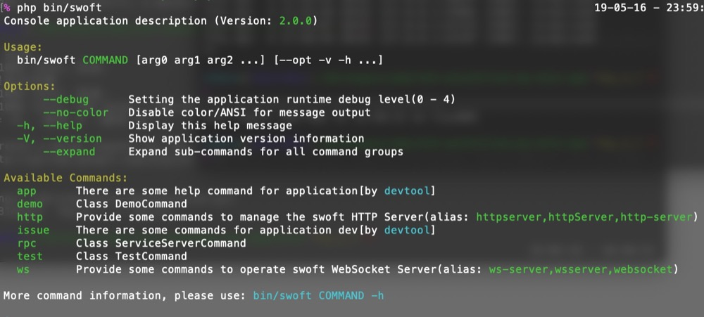

# 命令行

swoft 提供功能强大的命令行应用处理功能。swoft 的 http server, websocket server 等都是通过命令行启动和管理。



## 安装

```bash
composer require swoft/websocket-server
```

## 功能特性

- 命令行应用, 命令行的解析运行，基于注解 `@Command` `@CommandMapping` 自动收集注册
- 支持给命令、命令组设置别名,一个命令可以有多个别名。
- 功能全面的命令行的选项参数解析(命名参数，短选项，长选项 ...)，命令行下 `input`, `output` 管理、使用
- 命令方法注释自动解析为帮助信息（支持 `@CommandOption` `@CommandArgument` `@example` 等注解）
- 支持输出多种颜色风格的消息文本(`info`, `comment`, `success`, `warning`, `danger`, `error` ... )
- 常用的特殊格式信息显示(`section`, `panel`, `padding`, `helpPanel`, `table`, `title`, `list`, `multiList`)
- 丰富的动态信息显示(`pending/loading`, `pointing`, `spinner`, `counterTxt`, `dynamicText`, `progressTxt`, `progressBar`)
- 常用的用户信息交互支持(`select`, `multiSelect`, `confirm`, `ask/question`, `askPassword/askHiddenInput`)
- 颜色输出是 `windows` `linux` `mac` 兼容的，不支持颜色的环境会自动去除相关CODE
- 支持协程和非协程（传统同步阻塞）两种方式运行命令
- 内置Phar打包工具类，可以方便的将应用打包成`phar`文件，方便作为工具分发和使用
- 快速的为当前应用生成 `bash/zsh` 环境下的自动补全脚本(TODO)

> `swoft/console` 基于 [inhere/php-console](https://github.com/inhere/php-console) 改进，并参考了 [symfony/console](https://github.com/symfony/console) 部分特性

## Git仓库

- Github https://github.com/swoft-cloud/swoft-console

## 参与贡献

欢迎参与贡献，您可以

- fork 我们的开发仓库 [swoft/component](https://github.com/swoft-cloud/swoft-component)
- 修改代码然后发起 PR
- 关于发起PR的[注意事项](https://github.com/swoft-cloud/swoft/issues/829)
