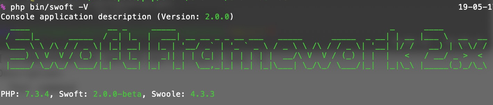
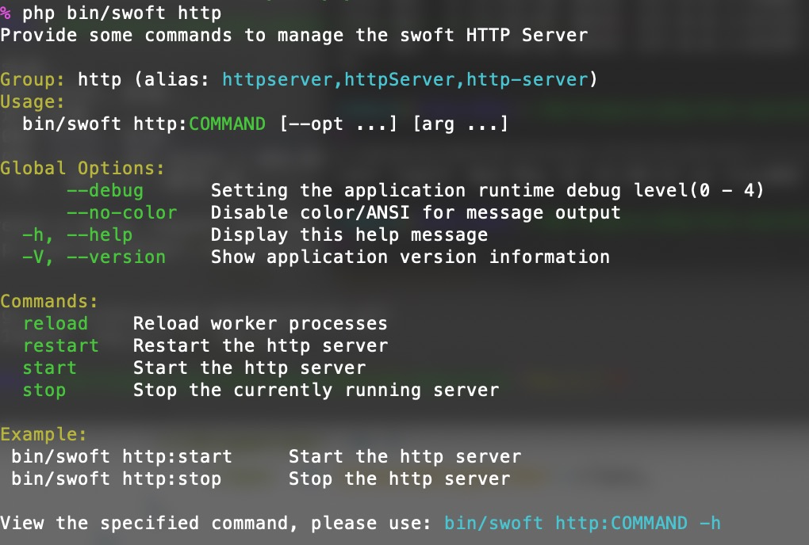
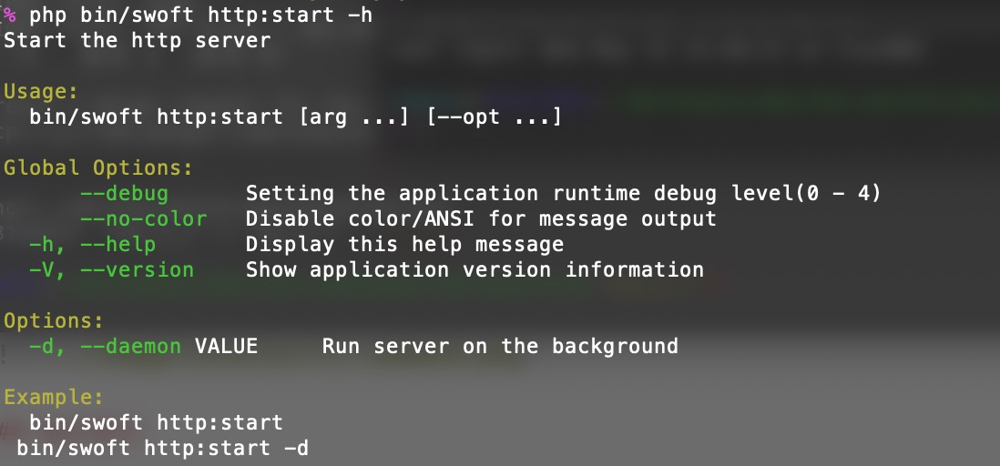

# 使用与运行

完成定义命令后，可以执行命令，处理对应业务逻辑

> 如果不特殊设置，swoft 默认在协程环境运行命令

## 特别说明

command 里是始终不可能直接操作server的。 你每运行一次 command，都是在一个全新的进程里，除了使用一样的代码，其他毫无关系。

## 查看命令

查看当前已经定义的所有命令组

```bash
php bin/swoft
# 或者
php bin/swoft -h
php bin/swoft --help
```


## 查看版本

查看当前 swoft 框架版本信息

```bash
php bin/swoft -V
# 或者
php bin/swoft --version
```



## 命令帮助信息

### 命令组帮助信息

```bash
php bin/swoft http
# 或者
php bin/swoft http -h
```



### 具体命令帮助信息

```bash
php bin/swoft http:start -h
# 或者
php bin/swoft http:start --help
```



## 执行命令

运行命令组下面，某个操作命令。

```bash
php bin/swoft http:start
```
