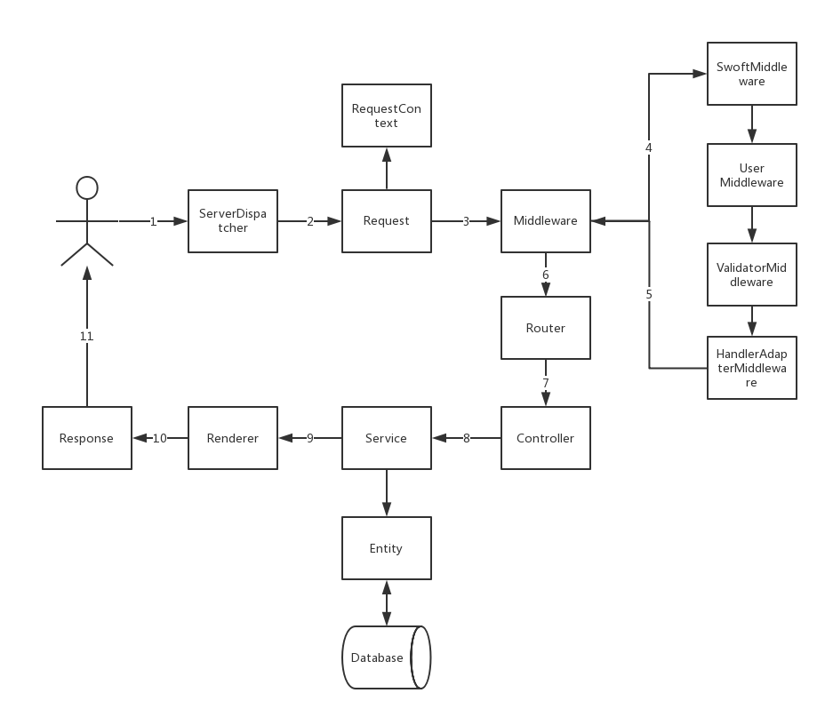

# 框架核心

## 简介
这一章节将帮助你了解 Swoft 是如何工作的，通过更好的了解整个框架，这有助于你更加清楚自己在做什么，更加清楚自己想实现的功能应该如何去实现，以及遇到问题时如何去定位问题。

## 应用组件
Swoft 采用组件化的开发模式，可自由组合各个组件来满足自己的业务实现，在简单业务下可以免于臃肿，在复杂业务下又游刃有余。  
以下为官方团队开发提供的组件，若有优秀的组件亦可在 Github 上提交 [issue](https://github.com/swoft-cloud/swoft-doc/issues) 增加在此列表上  

组件名称 | 维护者 | 简述
:- | :- | :- |
swoft-framework | 官方 | 框架基础及核心
swoft-http-server | 官方 | HTTP 服务组件
swoft-http-message | 官方 | 基于 PSR-7 实现的 HTTP 消息组件
swoft-http-client | 官方 | 基于 PSR-7 实现的 HTTP 客户端
swoft-rpc-server | 官方 | RPC 服务组件
swoft-rpc | 官方 | RPC 基础组件
swoft-rpc-client | 官方 | RPC 客户端组件
swoft-db | 官方 | 数据库组件
swoft-view | 官方 | 视图组件
swoft-process | 官方 | 进程组件
swoft-task | 官方 | 任务及计划任务组件
swoft-service-governance | 官方 | 服务治理组件
swoft-session | 官方 | Session 会话组件
swoft-console | 官方 | 控制台组件
swoft-cache | 官方 | 基于 PSR-16 实现的缓存组件
swoft-log | 官方 | 日志组件
swoft-memory | 官方 | 内存操作组件
swoft-redis | 官方 | 异步协程的 Redis 组件
swoft-i18n | 官方 | 国际化组件

## 生命周期

### 框架生命周期
Swoft 的一切都是建立在 [Swoole](https://wiki.swoole.com) 扩展之上运行的，想要了解整个生命周期就必须要了解 Swoole 的生命周期，此部分可查阅 [Swoole文档](https://wiki.swoole.com) 获得更多的资料。  
在 Swoft 服务启动阶段，我们主要关注 [OnWorkerStart](https://wiki.swoole.com/wiki/page/p-event/onWorkerStart.html) 事件，此事件会在 `Worker` 启动的时候触发，这个过程也是 `Swoft` 众多机制实现的关键，这时 `Swoft` 会去扫描目录、配置文件、注解信息、事件监听器等，并根据扫描到的注解信息执行对应的功能逻辑，并储存在与注解相对应的 `Collector` 容器内，包括但不限于注册路由信息，注册事件监听器，注册中间件，注册过滤器等等。

### 请求生命周期
每一个请求的开始到结束，都是由 Swoole 本身的 `onRequest()` 或 `onReceive()` 事件监听并委托给 `Dispatcher` 来处理并响应的，而 `Dispatcher` 的主要职责是负责调度请求生命周期内的各个参与者(组件)。  

在 `HTTP Server` 的情况下，将由 `ServerDispatcher` 来负责调度，参与者主要包括 `RequestContext`, `ExceptionHandler`, `RequestHandler` 。  
`RequestContext(请求上下文)` 作为当前的请求信息的容器将贯穿整个请求生命周期，负责信息的储存和传递；  
`ExceptionHandler(异常处理器)` 则是在遇到异常的情况下出来收拾场面的，确保在各种异常情况下依旧能给客户端返回一个预期内的结果；  
`RequestHandler(请求处理器)` 则是整个请求生命周期的核心组件，其实也就是 `Middleware(中间件)` ，该组件实现了 [PSR-15](https://www.php-fig.org/psr/psr-15/) 协议，负责将 `Request -> Router -> Controller -> Action -> Renderer -> Response` 这整一个请求流程贯穿起来，其实也就是从 `Request` 到 `Response` 的过程，只要在任意一个环节返回一个有效的 `Response` 对象便能对该请求做出响应并返回。  
下面是一张请求生命周期的流程示意图  
  
在 `RPC Server` 的情况下，由 `ServiceDispatcher` 来负责调度，与 `HTTP Server` 类似，区别在于参与者只有 `RequestContext` 和 `RequestHandler`，而 `RequestHandler`  内的 `Middleware` 也和 `HTTP Server` 的类似，比较明显的区别在于 `RPC Server` 下会有一个 `ServicePacker(数据打包器)` 来负责将服务方法或异常返回的数据打包成一个统一的数据格式，并返回给客户端。