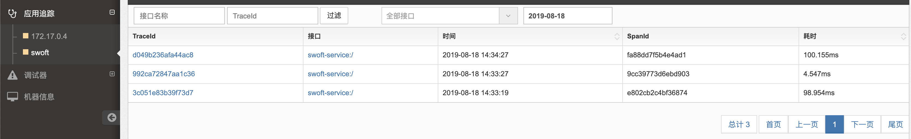

# Swoole Enterprise


[Swoole Enterprise](https://www.swoole-cloud.com/dashboard.html) 作为 `Swoole` 官方出品的一整套企业级`PHP`和`Swoole`分析调试工具，更专一、更专业。

- 时刻掌握应用架构模型
> 自动发现应用依赖拓扑结构和展示，时刻掌握应用的架构模型
- 分布式跨应用链路追踪
> 支持无侵入的分布式跨应用链路追踪，让每个请求一目了然，全面支持协程/非协程环境，数据实时可视化
- 全面分析报告服务状况
> 各种维度统计服务上报的调用信息， 比如总流量、平均耗时、超时率等，并全面分析报告服务状况
- 拥有强大的调试工具链
> 本系统支持远程调试，可在系统后台远程开启检测内存泄漏、阻塞检测和代码性能分析
- 完善的系统监控
> 支持完善的系统监控，零成本部署，监控机器的CPU、内存、网络、磁盘等资源，可以很方便的集成到现有报警系统
- 零成本接入系统
> 本系统的客户端提供脚本可一键部署，服务端可在Docker环境中运行，简单快捷

## 安装

### 安装扩展

注册完账户后，进入[控制台](https://www.swoole-cloud.com/dashboard/catdemo/)，并申请试用，下载对应客户端。

相关文档，请移步 [试用文档](https://www.yuque.com/swoole-wiki/try) 或 [详细文档](https://www.yuque.com/swoole-wiki/dam5n7) 

> 具体文档地址，以从控制台下载的对应客户端中展示的为准。

将客户端中的所有文件以及以下两个文件复制到项目目录 `swoole-dashboard` 中

1. `entrypoint.sh`

```bash
#!/usr/bin/env bash

/opt/swoole/script/php/swoole_php /opt/swoole/node-agent/src/node.php &

php /var/www/swoft/bin/swoft http:start

```

然后将下面的 `Dockerfile` 复制到项目根目录中。

```dockerfile
FROM swoft/swoft

LABEL maintainer="sakuraovq <sakuraovq@gmail.com>" version="2.0"

# This php version
ENV PHP_VERSION=72
# This is dashborad ini config
ENV SWOOLE_DASHBORAD_INI=/usr/local/etc/php/conf.d/swoole-plus.ini

ADD . /var/www/swoft

# The address here is displayed on the client side.
RUN  cd ./swoole-dashboard && ./deploy_env.sh www.swoole-cloud.com \
    && chmod 777 entrypoint.sh \
    && php_dir=$(php -r "echo @ini_get("extension_dir").PHP_EOL;") \
    && cp ./swoole_plus${PHP_VERSION}.so $php_dir/swoole_plus.so \
    # Enable swoole_plus
    && echo "extension=swoole_plus.so" > ${SWOOLE_DASHBORAD_INI} \
    # Open the main switch
    && echo "apm.enable=1" >> ${SWOOLE_DASHBORAD_INI} \
    # Sampling Rate, eg: 100% , 
    && echo "apm.sampling_rate=100" >> ${SWOOLE_DASHBORAD_INI} \
    # Turn on memory leak detection Default 0 Off
    && echo "apm.enable_memcheck=1" >> ${SWOOLE_DASHBORAD_INI}

CMD ["sh", "./swoole-dashboard/entrypoint.sh"]
```
### 采样率

采样率按照需求配置, 如果为 100%, 全部请求都会采样计算. 有损性能. 

### 安装组件

```bash
composer require swoft-cloud/swoft-swoole-dashboard
```

## 使用

在 `app/bean.php` 配置文件中注册 `Swoft\Swoole\Dashboard\Middleware\SwooleDashboardMiddleware` 中间件即可，如下：

```php
<?php

return [
       'httpDispatcher'    => [
           // Add global http middleware
           'middlewares' => [
               \Swoft\Swoole\Dashboard\Middleware\SwooleDashboardMiddleware::class,
           ],
       ],
];
```

## 配置 

默认 `Swoft` 仅开启了 链路追踪 在 在 `app/bean.php` 配置文件中 配置 `swooleDashboard` 即可, 如下:


```php
<?php

return [
    'swooleDashboard'   => [
        'performanceAnalysis' => false,
        'blockCheck'          => true,
        'memoryLeakCheck'     => true,
        'linkTracking'        => true,
    ],
];
```

- performanceAnalysis 开启性能分析
- blockCheck 阻塞检查, 阻塞检查和性能分析不宜一起开启他们会相互影响
- memoryLeakCheck 内存泄露
- linkTracking 链路追踪

### 链路追踪

配置了中间件框架会自动开启链路追踪, 你也可以单独使用它 例如:
```php
/** @var SwooleDashboard $swooleDashboard */
$swooleDashboard = bean('swooleDashboard');

$tick = $swooleDashboard->startRpcAnalysis('/get/user', 'demo', '53.65.77.11', $traceId, $spanId);

// todo ...
$handlerStatus = true;
$errno         = 401;

$swooleDashboard->endAnalysis($tick, $handlerStatus, $errno);
```

登录管理后台看链路追踪


 
 ### 阻塞检查
 
单独使用, 默认 是开始到结束处理时间
 
 ```php
/** @var SwooleDashboard $swooleDashboard */
$swooleDashboard = bean('swooleDashboard');

$swooleDashboard->startBlockCheck();
// todo ...

$swooleDashboard->endBlockCheck();
```