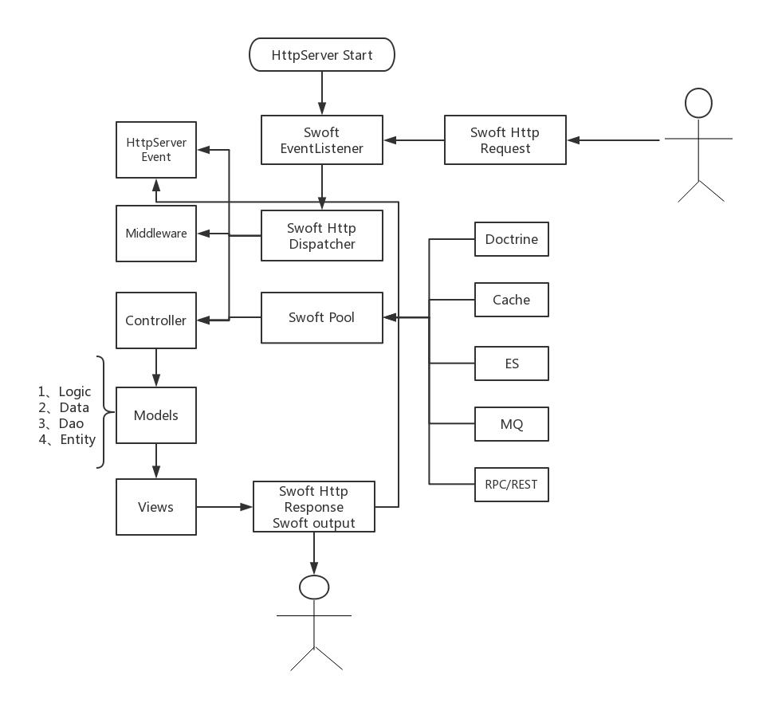
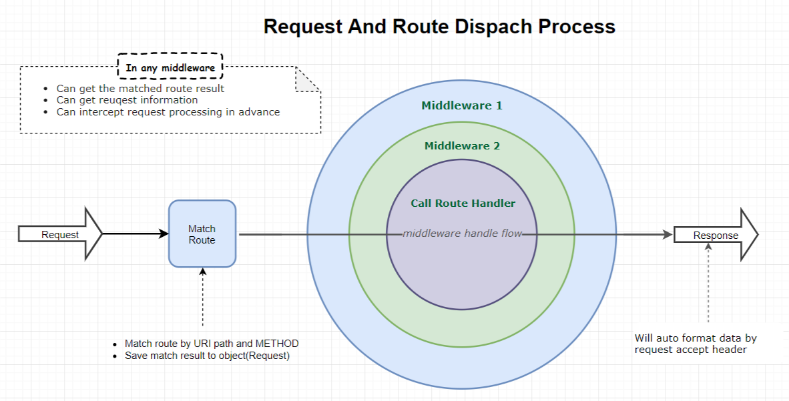

# http 服务器

基于 \Swoole\Http\Server 实现的协程HTTP服务, 框架层做了很好的封装, 用户按照传统的 MVC 方式编写代码, 就能获得协程带来的超高性能.

## http 生命周期

了解请求生命周期, 有利于理解HTTP服务各组件, 编写出更好代码.

## 请求处理流程

## 功能特色

- 基于 PSR-7 的 HTTP 消息实现
- 基于 PSR-15 的中间件
- `@Controller` 灵活的控制器注解
- `@RequestMapping` 灵活的路由注解

## Git仓库

- Github https://github.com/swoft-cloud/swoft-http-server

## 参与贡献

欢迎参与贡献，您可以

- fork 我们的开发仓库 [swoft/component](https://github.com/swoft-cloud/swoft-component)
- 修改代码然后发起 PR
- 关于发起PR的[注意事项](https://github.com/swoft-cloud/swoft/issues/829)
