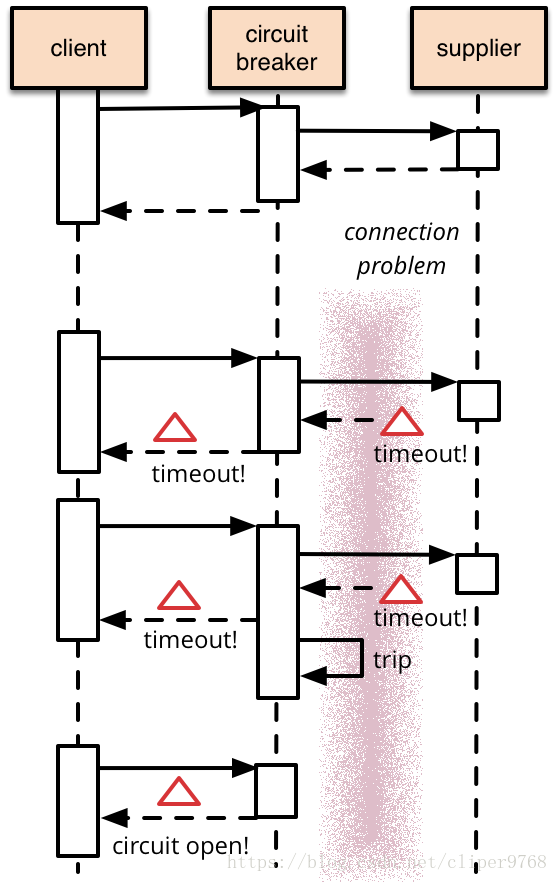
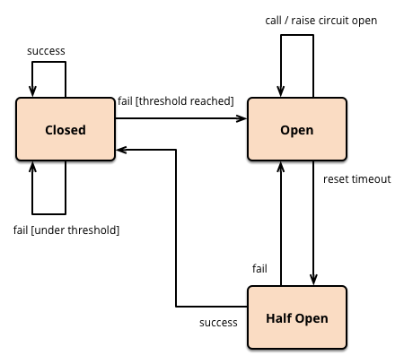

# 熔断器

在分布式环境下，特别是微服务结构的分布式系统中， 一个软件系统调用另外一个远程系统是非常普遍的。这种远程调用的被调用方可能是另外一个进程，或者是跨网路的另外一台主机, 这种远程的调用和进程的内部调用最大的区别是，远程调用可能会失败，或者挂起而没有任何回应，直到超时。更坏的情况是， 如果有多个调用者对同一个挂起的服务进行调用，那么就很有可能的是一个服务的超时等待迅速蔓延到整个分布式系统，引起连锁反应， 从而消耗掉整个分布式系统大量资源。最终可能导致系统瘫痪。断路器（Circuit Breaker）模式就是为了防止在分布式系统中出现这种瀑布似的连锁反应导致的灾难。


**基本模式**




上图是断路器（Curcuit Breaker）的结构，它有两个基本状态（close和open）和一个基本trip动作：
- close状态下， client向supplier发起的服务请求， 直接无阻碍通过断路器， supplier的返回值接直接由断路器交回给client.
- open状态下，client向supplier发起的服务请求后，断路器不会将请求转到supplier, 而是直接返回client, client和supplier之间的通路是断的
- trip: 在close状态下，如果supplier持续超时报错， 达到规定的阀值后，断路器就发生trip, 之后断路器状态就会从close进入open.

**扩展模式**




基本的断路器模式下，保证了断路器在open状态时，保护supplier不会被调用， 但我们还需要额外的措施可以在supplier恢复服务后，可以重置断路器。一种可行的办法是断路器定期探测supplier的服务是否恢复， 一但恢复， 就将状态设置成close。断路器进行重试时的状态为半开（half-open）状态。


Swoft 熔断器底层采用扩展模式设计，开发者必须先熟悉熔断器状态变化，这样有利于对熔断器的理解。

## 安装

使用熔断器前必须安装 swoft-breaker 组件，安装方式如下：

```
composer require swoft/breaker
```

## 配置

熔断器不使用配置也是可以使用的，但是有些业务场景需要全局配置熔断器，可以参考如下配置：

app/bean.php
```php
return [
    'breaker' => [
         'timeout' => 3,
    ]
]
```

详细参数：

- timeout   超时时间
- failThreshold 连续失败多少次状态切换阀门
- sucThreshold 连续成功多少次状态切换阀门
- retryTime 熔断器由开启状态到半开状态尝试切换时间

> 全局配置会被 `@Breaker` 上面的局部注解覆盖

## 使用


熔断器的使用相当简单且功能强大，使用一个 `@Breaker` 注解即可，Swoft 中的熔断是针对于类里面的方法熔断，只要方法里面没有抛出异常就说明是成功访问的，所以 `@Breaker` 注解可以在任何 bean对象方法上面使用。

```php
<?php declare(strict_types=1);


namespace App\Model\Logic;

use Exception;
use Swoft\Bean\Annotation\Mapping\Bean;
use Swoft\Breaker\Annotation\Mapping\Breaker;

/**
 * Class BreakerLogic
 *
 * @since 2.0
 *
 * @Bean()
 */
class BreakerLogic
{
    /**
     * @Breaker(fallback="funcFallback")
     *
     * @return string
     * @throws Exception
     */
    public function func(): string
    {
        // Do something

        throw new Exception('Breaker exception');
    }

    /**
     * @Breaker()
     *
     * @return string
     * @throws Exception
     */
    public function func2(): string
    {
        // Do something

        return 'func2';
    }

    /**
     * @return string
     */
    public function funcFallback(): string
    {
        return 'funcFallback';
    }
    
    /**
     * @Breaker()
     *
     * @return string
     * @throws Exception
     */
    public function unFallback(): string
    {
        // Do something

        throw new Exception('Breaker exception');
    }

    /**
     * @Breaker(fallback="loopFallback")
     *
     * @return string
     * @throws Exception
     */
    public function loop(): string
    {
        // Do something

        throw new Exception('Breaker exception');
    }

    /**
     * @Breaker(fallback="loopFallback2")
     *
     * @return string
     * @throws Exception
     */
    public function loopFallback(): string
    {
        // Do something

        throw new Exception('Breaker exception');
    }

    /**
     * @Breaker(fallback="loopFallback3")
     *
     * @return string
     * @throws Exception
     */
    public function loopFallback2(): string
    {
        // Do something

        throw new Exception('Breaker exception');
    }

    /**
     * @return string
     */
    public function loopFallback3(): string
    {
        return 'loopFallback3';
    }
}
```

这里示例定义了几种使用场景
- 函数正常没有一次抛出 (`func2`)
- 函数抛出异常通过降级函数返回数据 (`func`)
- 定义熔断器没有定义降级函数 (`unFallback`)
- 循环执行熔断器 (`loop`)


循环执行熔断器这里详细讲解下流程

- 执行 `loop` 函数，抛出异常，执行 `loopFallback` 降级函数
- `loopFallback2` 降级函数，抛出异常，但是定义了熔断器和降级函数，所以继续执行 `loopFallback2` 降级函数
- `loopFallback2` 降级函数，此时这里正常返回降级的数据

<p class="tip"> `fallback` 函数必须和 `@Breaker` 标记的函数完全一样除了名称不一样且在同一个类里面。 </p>

## 注解

熔断器就用了一个 `@Breaker` 注解，该注解，必须定义在 bean 对象里面。

### @Breaker

标记方法开启熔断器，如下参数详解：

- fallback 降级函数，必须和 `@Breaker` 标记的函数完全一样除了名称不一样且在同一个类里面
- sucThreshold 连续成功多少次状态切换阀门
- failThreshold 连续失败多少次状态切换阀门
- timeout 超时时间
- retryTime 熔断器由开启状态到半开状态尝试切换时间

> 注意：注解上面的配置会覆盖熔断器全局配置
