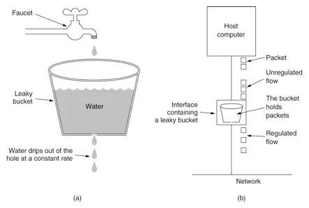
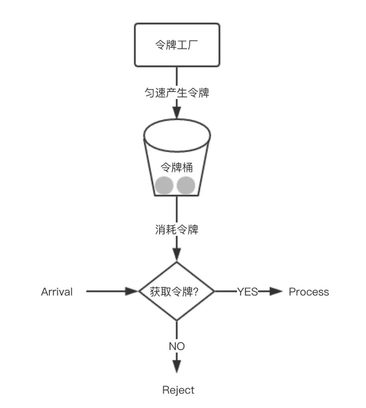

# 服务限流

限流是对稀缺资源访问时，比如秒杀，抢购的商品时，来限制并发和请求的数量，从而有效的进行削峰并使得流量曲线平滑。限流的目的是对并发访问和并发请求进行限速，或者一个时间窗口内请求进行限速从而来保护系统，一旦达到或超过限制速率就可以拒绝服务，或者进行排队等待等。

## 限流算法

### 计数器

采用计数器实现限流有点简单粗暴，一般我们会限制一秒钟的能够通过的请求数，比如限流qps为100，算法的实现思路就是从第一个请求进来开始计时，在接下去的1s内，每来一个请求，就把计数加1，如果累加的数字达到了100，那么后续的请求就会被全部拒绝。等到1s结束后，把计数恢复成0，重新开始计数。

这种实现方式，相信大家都知道有一个弊端：如果我在单位时间1s内的前10ms，已经通过了100个请求，那后面的990ms，只能眼巴巴的把请求拒绝，我们把这种现象称为“突刺现象”

### 漏桶

为了消除"突刺现象"，可以采用漏桶算法实现限流，漏桶算法这个名字就很形象，算法内部有一个容器，类似生活用到的漏斗，当请求进来时，相当于水倒入漏斗，然后从下端小口慢慢匀速的流出。不管上面流量多大，下面流出的速度始终保持不变。

不管服务调用方多么不稳定，通过漏桶算法进行限流，每10毫秒处理一次请求。因为处理的速度是固定的，请求进来的速度是未知的，可能突然进来很多请求，没来得及处理的请求就先放在桶里，既然是个桶，肯定是有容量上限，如果桶满了，那么新进来的请求就丢弃。



这种算法，在使用过后也存在弊端：无法应对短时间的突发流量。

### 令牌桶

某种意义上讲，令牌桶算法是对漏桶算法的一种改进，桶算法能够限制请求调用的速率，而令牌桶算法能够在限制调用的平均速率的同时还允许一定程度的突发调用。

在令牌桶算法中，存在一个桶，用来存放固定数量的令牌。算法中存在一种机制，以一定的速率往桶中放令牌。每次请求调用需要先获取令牌，只有拿到令牌，才有机会继续执行，否则选择选择等待可用的令牌、或者直接拒绝。

放令牌这个动作是持续不断的进行，如果桶中令牌数达到上限，就丢弃令牌，所以就存在这种情况，桶中一直有大量的可用令牌，这时进来的请求就可以直接拿到令牌执行，比如设置qps为100，那么限流器初始化完成一秒后，桶中就已经有100个令牌了，这时服务还没完全启动好，等启动完成对外提供服务时，该限流器可以抵挡瞬时的100个请求。所以，只有桶中没有令牌时，请求才会进行等待，最后相当于以一定的速率执行。





> Swoft 限流器底层采用的是令牌桶算法，底层依赖于 Redis 实现分布式限流。


##  令牌桶实现原理

对于令牌桶中令牌的产生一般有两种做法：

- 一种解法是，开启一个定时任务，由定时任务持续生成令牌。这样的问题在于会极大的消耗系统资源，如，某接口需要分别对每个用户做访问频率限制，假设系统中存在6W用户，则至多需要开启6W个定时任务来维持每个桶中的令牌数，这样的开销是巨大的。
- 第二种解法是延迟计算，定义一个 resync 函数。该函数会在每次获取令牌之前调用，其实现思路为，若当前时间晚于nextFreeTicketMicros，则计算该段时间内可以生成多少令牌，将生成的令牌加入令牌桶中并更新数据。这样一来，只需要在获取令牌时计算一次即可。


Swoft 采用的是第二种，当每次获取令牌时，先执行resync来更新令牌桶中令牌的数量，从而达到异步产生令牌的目的。下面开始详解讲解，如何使用 swoft-limiter 组件，进行开发。


## 安装

如上已经详解讲解了限流器实现原理，使用限流器前，必须安装 swoft-limiter 组件，安装命令如下：

```
composer require swoft/limiter
```

## 配置

限流器不使用配置也是可以使用的，但是有些业务场景需要全局配置限流器，可以参考如下配置：

```php
return [
    'rateLimiter' => [
        'class'      => RateLimter::class,
        'rateLimter' => bean('redisRateLimiter'),
    ]
];
```

详细参数：
- name 限流器名称，默认 `swoft:limiter`
- rate 允许多大的请求访问，请求数/秒
- max 最大的请求数
- default 初始化请求数

> 全局配置会被 `@Limiter` 注解的局部配置覆盖

缓存限速信息也是可以配置的，配置如下：

return [
    'redisRateLimiter' => [
        'pool' => 'redis.pool'
    ];
];

- pool 指定使用的缓存连接池名称，默认使用框架默认的连接池

<p class="tip"> 使用限速器，一定要配置安装 redis 组件，且配置可用的 redis 缓存 </p>

## 使用

### 控制器限速

本节以常见的限速场景为例：

```php
<?php declare(strict_types=1);

namespace App\Http\Controller;

use Swoft\Http\Message\Request;
use Swoft\Http\Server\Annotation\Mapping\Controller;
use Swoft\Http\Server\Annotation\Mapping\RequestMapping;
use Swoft\Limiter\Annotation\Mapping\RateLimiter;

/**
 * Class LimiterController
 *
 * @since 2.0
 *
 * @Controller(prefix="limiter")
 */
class LimiterController
{
    /**
     * @RequestMapping()
     * @RateLimiter(key="request.getUriPath()")
     *
     * @param Request $request
     *
     * @return array
     */
    public function requestLimiter(Request $request): array
    {
        $uri = $request->getUriPath();
        return ['requestLimiter', $uri];
    }

    /**
     * @RequestMapping()
     * @RateLimiter(rate=20, fallback="limiterFallback")
     *
     * @param Request $request
     *
     * @return array
     */
    public function requestLimiter2(Request $request): array
    {
        $uri = $request->getUriPath();
        return ['requestLimiter2', $uri];
    }

    /**
     * @RequestMapping()
     * @RateLimiter(key="request.getUriPath()~':'~request.query('id')")
     *
     * @param Request $request
     *
     * @return array
     */
    public function paramLimiter(Request $request): array
    {
        $id = $request->query('id');
        return ['paramLimiter', $id];
    }

    /**
     * @param Request $request
     *
     * @return array
     */
    public function limiterFallback(Request $request): array
    {
        $uri = $request->getUriPath();
        return ['limiterFallback', $uri];
    }
}
```

- requestLimiter 方法根据 URI 请求地址限流
- requestLimiter2 方法根据类名+方法名称限流，其实和 requestLimiter限流的功能是一样的， 但是定义了一个降级函数
- paramLimiter 方法根据URI地址+参数限流


> key 这里支持 `symfony/expression-language` 表达式，可以实现很多复杂的功能，[详细文档](http://www.symfonychina.com/doc/current/components/expression_language/syntax.html), 如果被限速会抛出 `Swoft\Limiter\Exception\RateLImiterException` 异常。key 表达式内置 `CLASS`(类名) 和 `METHOD`(方法名称) 两个变量，方便开发者使用。


### 方法限速

Swoft 限速器不仅可以限流控制器，也可以限制任何 bean 里面的方法，可以控制方法的访问速率。这里以下面使用示例详解

```php
<?php declare(strict_types=1);

namespace App\Model\Logic;

use Swoft\Bean\Annotation\Mapping\Bean;
use Swoft\Limiter\Annotation\Mapping\RateLimiter;

/**
 * Class LimiterLogic
 *
 * @since 2.0
 *
 * @Bean()
 */
class LimiterLogic
{
    /**
     * @RateLimiter(fallback="limterFallback")
     *
     * @return array
     */
    public function limter(): array
    {
        // Do something

        return [];
    }

    /**
     * @RateLimiter(key="requestBean.getName('name')")
     *
     * @param RequestBean $requestBean
     *
     * @return array
     */
    public function limterParams(RequestBean $requestBean): array
    {
        // Do something

        return [];
    }

    /**
     * @return array
     */
    public function limterFallback(): array
    {
        return [];
    }
}
```

- limtier 方法，根据类名+方法名称限速且定义了一个降级函数
- limtierParams 方法，根据调用 RequestBean 对象的方法，返回值作为限流 key

<p class="tip"> `fallback` 函数必须和 `@RateLimiter` 标记的函数完全一样除了名称不一样且在同一个类里面。 如果被限速会抛出 `Swoft\Limiter\Exception\RateLImiterException` 异常。key 表达式内置 `CLASS`(类名) 和 `METHOD`(方法名称) 两个变量，方便开发者使用。</p>

## 注解

限流器注解很简单，只涉及一个 `@RateLimiter` 注解

### @RateLimiter

标记方法，开启限流策略，详细参数如下

- name 缓存前缀
- rate 允许多大的请求访问，请求数/秒
- key 限流 key, 支持 `symfony/expression-language` 表达式，key 表达式内置 `CLASS`(类名) 和 `METHOD`(方法名称) 两个变量，方便开发者使用。
- max 最大的请求数
- default 初始化请求数
- fallback 降级函数，和 breaker 一样


