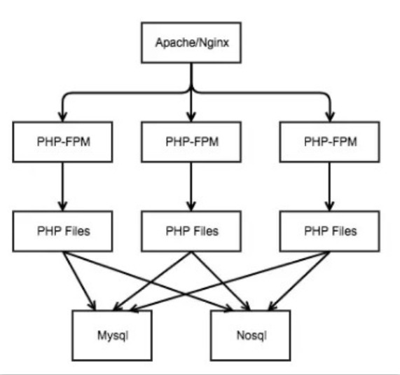

# 传统架构

在 `Nginx` + `PHP-Fpm` 模式下开发非常简单 不用担心 内存泄露。

`php`的`fastcgi`进程管理器`php-fpm`和`nginx`的配合已经运行得足够好，但是由于`php-fpm`本身是**同步阻塞进程模型**，在请求结束后释放所有的资源（包括框架初始化创建的一系列对象，导致PHP进程**空转**（创建<-->销毁<-->创建）消耗大量的`CPU`资源，从而导致单机的吞吐能力有限。请求夯住，会导致 `CPU` 不能释放资源， 大大浪费了 `CPU` 使用率。

## php-fpm

php-fpm进程模型也非常简单的，是 属于[预派生子进程模式](#预派生子进程模式) 大家想必知道早期的 Apache 就是采用该模式 来一个请求就 `fork` 一个进程，进程的开销是非常大的。这会大大降低吞吐率，并发数由进程数决定。

### 预派生子进程模式

程序启动后就会创建`N`个进程。每个子进程进入`Accept`，等待新的连接进入。当客户端连接到服务器时，其中一个子进程会被唤醒，开始处理客户端请求，并且不再接受新的`TCP连接`。当此连接关闭时，子进程会释放，重新进入`Accept`，参与处理新的连接。

#### 优势

这个模型的优势是完全可以复用进程，不需要太多的上下文切换。

#### 劣势

这种模型严重依赖进程的数量解决并发问题，一个客户端连接就需要占用一个进程，工作进程的数量有多少，并发处理能力就有多少。操作系统可以创建的进程数量是有限的。

PHP框架初始化会占用大量的计算资源，每个请求都需要初始化。

启动大量进程会带来额外的进程调度消耗。数百个进程时可能进程上下文切换调度消耗占CPU不到1%可以忽略不计，如果启动数千甚至数万个进程，消耗就会直线上升。调度消耗可能占到 CPU 的百分之几十甚至 100%。

如果请求一个第三方请求非常慢，请求过程中会一直占用 `CPU` 资源，浪费了昂贵的硬件资源

> 例如：即时聊天程序，一台服务器可能要维持数十万的连接，那么就要启动数十万的进程来持。这显然不可能

有没有一种技术可以在一个进程内处理所有并发`IO`呢？答案是有，这就是[IO复用](./io.md)技术。

## php-fpm工作模式的问题

- `nginx`基于`epoll`事件模型，一个`worker`同时可处理多个请求

- `fpm-worker`在同一时刻可处理一个请求

- `fpm-worker`每次处理请求前需要重新初始化`mvc`框架，然后再释放资源

- 高并发请求时，`fpm-worker`不够用，`nginx`直接响应502

- fpm-worker进程间切换消耗大

## 那我们还有什么解决方案 ？

我们分析我们的业务不难发现，`90%`以上的业务都是**IO密集性业务**，我们只需要提高IO复用的能力就可以提升单机吞吐能力，另外需要将`php-fpm`**同步阻塞模式**替换为**异步非阻塞模式**，异步开启模式比较复杂不易维护，当然不一定使用`php-fpm`，就可以解决我们的核心问题——性能。

在 **IO密集性业务** 中我们需要频繁的上下文切换，采用线程模式开发太过复杂。

一个进程中能开的线程数也有限，线程太多也会增加 `CPU` 的负荷和内存资源，线程没有**阻塞态**，IO 阻塞也不能主动让出 `CPU`资源，属于**抢占式调度模型**。不太适合 php 开发。

在 `swoole 4.+`开启了全协程模式，让同步代码异步执行。详情请看[为什么要使用 swoole](./swoole.md)

