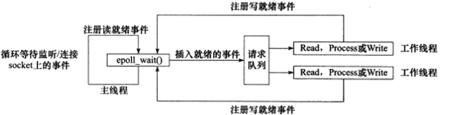

# IO 多路复用

这的复用指的是复用的`线程`，其实IO复用的历史和多进程一样长。

## select/poll
Linux很早就提供了 select 系统调用，可以在一个进程内维持1024个连接。

后来又加入了poll系统调用，poll做了一些改进，解决了 1024 限制的问题，可以维持任意数量的连接。

但select/poll还有一个问题就是，它需要循环检测连接是否有事件。

这样问题就来了，如果服务器有100万个连接，在某一时间只有一个连接向服务器发送了数据，select/poll需要做循环100万次，其中只有1次是命中的，剩下的99万9999次都是无效的，白白浪费了CPU资源。
             
             
## epoll             
直到Linux 2.6内核提供了新的`epoll`系统调用，可以维持无限数量的连接，而且无需轮询，这才真正解决了 `C10K` 问题。现在各种高并发异步IO的服务器程序都是基于`epoll`实现的，比如`Nginx、Node.js、Erlang、Golang`。像 `Node.js`，`Redis` 这样单进程单线程的程序，都可以维持超过1百万TCP连接，全部归功于`epoll`技术。

在这就不得不提，基于 `epoll` 实现的 `Reacter` 模型，`IO复用`**异步非阻塞**程序使用经典的`Reactor`模型，`Reactor`顾名思义就是`反应堆`的意思，它本身不处理任何数据收发。只是可以监视一个`socket句柄`的事件变化。
                

### 高效的事件处理模式Reactor 模式    
            
- 主进程/线程往`epoll内核亊件`中注册`socket`上的读就绪亊件。

- 主进程/线程调用`epoll_wait`等待`socket`上有数据可读。

- 当`socket`上有数据可读时，`epoll_wait`通知主进程/线程。主进程/线程则将`socket`可读事件放入请求队列。

- 睡眠在请求队列上的某个工作线程被唤醒，它从`socket`读取数据，并处理客户请求， 然后往`epoll`内核爭件表中注册该`socket`上的写就绪事件。

- 主线程调用`epoll_wait`等待`socket`可写。

- 当`socket`可写时，`epoll_wait`通知主进程/线程主进程/线程将`socket`可写事件放入清求队列。

- 睡眠在请求队列上的某个工作线程被唤醒，它往`socket`上写人服务器处理客户淸求 

`swoole` 的 `Reacter` 线程 也是基于 `Reacter` 模型实现的