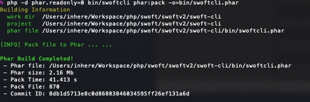

# 打包Phar

swoft-cli 工具提供了一个简单的命令，可用于将一个php应用（不限于swoft）打包成一个Phar包。

> 要使用此功能，请确保 `phar` 扩展是启用的。通常情况下，这个扩展在php里是默认启用的

## 构建Phar

```bash
php -d phar.readonly=0 swoftcli phar:pack -o=myapp.phar
```

可用选项(_通过帮助查看_)：

- `-c, --config` 指定打包用的配置文件，默认读取当前目录下的 `phar.build.inc`
- `--dir` 要打包的应用目录，默认是当前目录
- `-o, --output` 打包后输出的文件名称，默认是 `app.phar`

> 注意：运行时必须在前面为php加上选项 `-d phar.readonly=0`

运行效果：



### phar 打包配置

phar 打包需要一个配置文件，可以配置一些需要打包的目录、文件等。通常放置于项目根目录下。

```php
<?php
/**
 * The is a config file for compile phar package.
 * @var \Swoft\Console\Advanced\PharCompiler $compiler
 */

// config
$compiler
    // 删除代码注释。打包swoft 应用需要配合 setStripFilter()
    ->stripComments(true)
    ->setShebang(true)
    // 需要打包的文件后缀，内置已经包含了 .php
    ->addSuffix(['.tpl', '.json'])
    // 排除打包目录，排除一些无用的目录，可以有效减少输出文件大小
    ->addExcludeDir([
        'test',
        'doc',
        'docs',
        'tests',
        'Tests',
        'example',
        'runtime',
        'swoole-ide-helper',
    ])
    // 指定添加的文件
    ->addFile([
        'LICENSE',
        'composer.json',
        'README.md',
        'bin/bootstrap.php',
    ])
    ->setCliIndex('bin/swoft') // 应用入口
    // ->setWebIndex('web/index.php')
    // ->setVersionFile('config/config.php')
;

// 那些目录需要去除注释。Swoft 相关都不能去除注释
$stripDirs = [
    'psr/',
    'nikic/',
    'monolog/',
    'symfony/',
    'toolkit/',
];

$compiler->setStripFilter(function ($file) use ($stripDirs) {
    /** @var \SplFileInfo $file */
    $path = $file->getPathname();

    foreach ($stripDirs as $dir) {
        if (\strpos($path, $dir)) {
            return true;
        }
    }

    return false;
});
```

## 展开Phar包

将一个打包过的 phar 展开，类似于解压缩。

```bash
swoftcli phar:unpack myapp.phar
```


