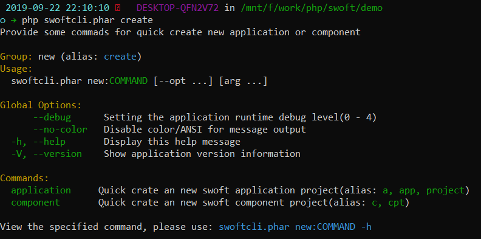
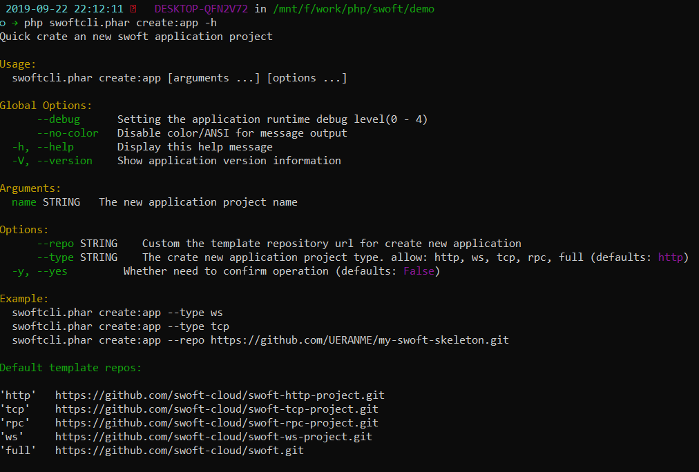
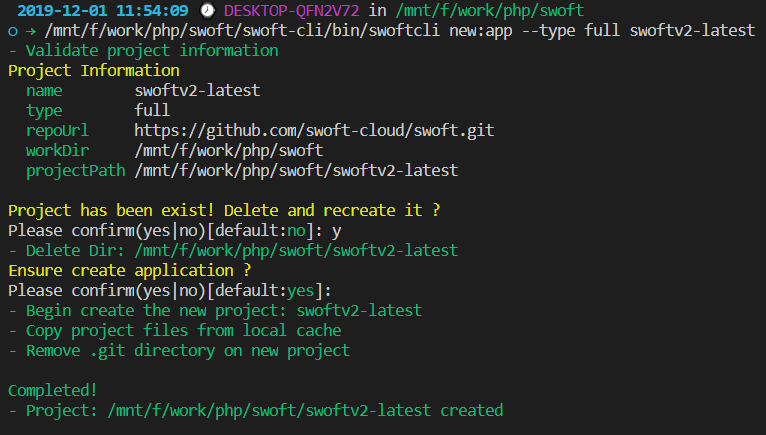
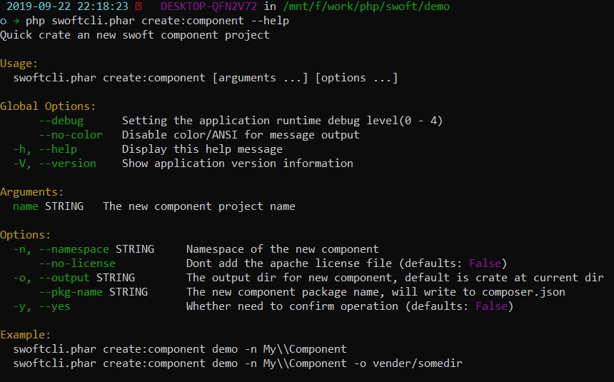
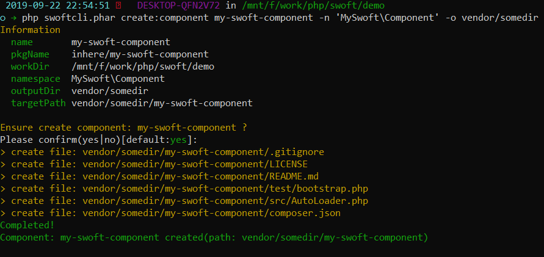

# 创建新应用或组件

自swoftcli `v0.1.0` 起，支持通过内置命令快速的创建一个新的应用骨架，或者创建一个新的组件骨架结构。

## 查看命令组

```bash
php swoftcli.phar new
// or use alias
php swoftcli.phar create
```

命令组说明：

- 命令组 `new` (组别名 `create`)，通过任意一个都可以访问到它
- 拥有两个子命令，`application` 和 `component` 分别用于创建新的应用和新的组件结构



## 创建新应用

创建新应用是通过拉取github上已存在的模板项目仓库，因此您可以轻松自定义符合自己需求的模板。

swoft默认提供了5个模板仓库，方便用户根据需要拉取不同的骨架结构。可以在下面的命令帮助中看到有哪几个默认骨架。

### 查看命令

```bash
php swoftcli.phar create:app -h
// or use alias
php swoftcli.phar create:app
```



### 命令使用说明

命令参数：

- `name` _string_ 设置新项目名称，同时也是作为新应用的目录名。**必须**

命令选项：

- `--repo` _string_ 自定义设置模板仓库的git地址，可以是 `UERANME/REPO` 或者 完整url地址
- `--type` _string_ 从默认的提供的5个模板仓库里选择一个来作为源仓库，默认是 `http`

> `YOUR_APP_NAME` 指的是你的新项目名称，同时也是作为新应用的目录名。

直接使用 `create:app YOUR_APP_NAME`，默认使用 `swoft-http-project` 模板仓库。
如果需要ws/tcp/rpc等模板仓库作为基础模板，可以如下指定 `type` 选项。

```bash
php swoftcli.phar create:app --type ws YOUR_APP_NAME
php swoftcli.phar create:app --type tcp YOUR_APP_NAME
```

如果你需要对模板做一些完全的自定义，那你就可以在自己的github创建需要的模板仓库，然后使用如下命令来使用：

```bash
php swoftcli.phar create:app --repo UERANME/REPO YOUR_APP_NAME
```

使用的完整的git仓库地址；这时不限于从github拉取，即也可以从自己的git服务拉取来初始化一个新应用。

```bash
php swoftcli.phar create:app --repo https://github.com/UERANME/REPO.git YOUR_APP_NAME
```

### 使用命令创建新应用

我们来试试创建新应用的命令。

```bash
php swoftcli.phar create:app --type http my-swoft-app
```

我们可以看到如下信息：



## 创建新组件

swoft 也提供了简单快捷的命令来创建一个新的组件骨架。

> 骨架结构非常简单，包含 `composer.json` `README.md` `AutoLoader.php` 等基础文件

### 查看命令

```bash
php swoftcli.phar create:component --help
// or use alias
php swoftcli.phar create:c
```



### 命令使用说明

命令参数：

- `name` _string_ 设置新组件的名称，同时也是作为组件目录名。**必须**

命令选项：

- `-n, --namespace` _string_ 设置组件的命名空间，设置后会自动写入到 `composer.json` 的PSR4加载。
- `--no-licence` _bool_ 是否添加 LICENSE 文件，默认会添加
- `-o, --output` _string_ 组件创建输出路径；不设置则创建到当前目录下
- `--pgk-name` _string_ 组件的包名，会自动写入到 `composer.json`。为空则会根据当前用户名加上组件名组成

### 使用命令创建新应用

我们来试试创建一个新的组件结构。

```bash
php swoftcli.phar create:component my-swoft-component -n 'MySwoft\Component' -o vendor/somedir
```

我们可以看到如下信息：


