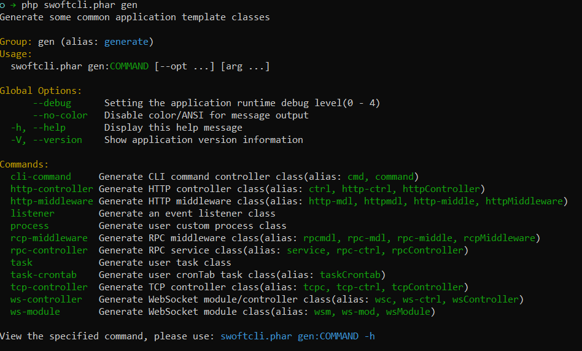

# 生成应用类文件

自swoftcli `v0.1.0` 起，支持通过内置命令快速的创建一个应用类。

支持创建：

- console command class
- event listener class
- task class
- crontab task class
- http controller class
- http middleware class
- rpc controller class
- rpc middleware class
- tcp controller class
- websocket module class
- websocket controller class
- and more ...

## 查看命令组

```bash
php swoftcli.phar gen
// or
php swoftcli.phar gen --help
```



## 命令使用

- 生成http controller

```bash
php swoftcli.phar gen:http-ctrl user --prefix /users
```

- 生成http middleware

```bash
php swoftcli.phar gen:http-mdl demo
```

- 生成websocket module

```bash
php swoftcli.phar gen:ws-mod chat --prefix /chat
```

- 生成websocket controller

```bash
php swoftcli.phar gen:ws-ctrl chat --prefix /chat
```

