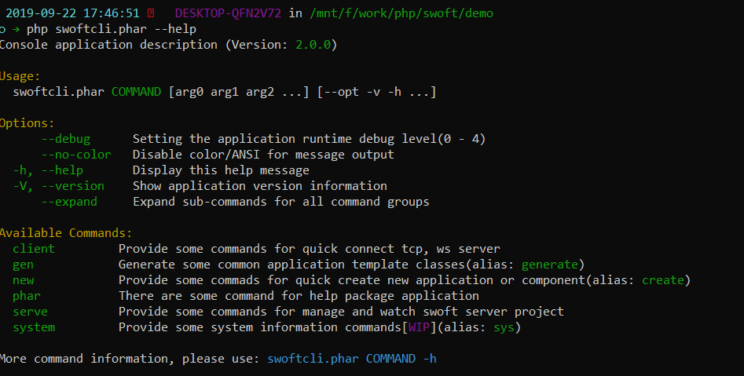

# Swoft CLI

Swoft CLI 是一个独立的命令行应用包，提供了一些内置的工具方便开发者使用。

- 生成Swoft应用类文件，例如：http控制器，websocket模块类等等
- 监视用户swoft项目的文件更改并自动重新启动服务器
- 快速创建新应用项目或新的组件（http, rpc, tcp, websocket服务）
- 将一个swoft应用打包成 phar 包

后续会根据用户需要增加更多的帮助工具，欢迎用户提供意见和贡献代码

> swoft-cli 是基于 swoft 2.0 构建的应用，运行使用同样需要swoole

## 运行预览

## 仓库

- github https://github.com/swoft-cloud/swoft-cli

## 参与贡献

您可以 fork 仓库修改然后发起 PR
