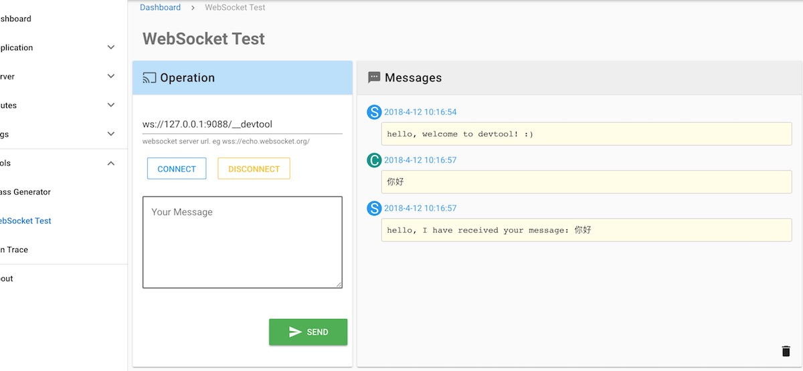

# websocket 控制器

在根据上两章安装配置好之后，就可以在 `app/WebSocket` 下创建需要的 websocket 控制器来处理相关逻辑

## 说明

### 注解tag

websocket 新增了类注解tag `@WebSocket`

- 说明

```php
/**
 * @WebSocket("/echo")
 */
```

上面的注解标明了允许ws连接的URI path. 即客户端请求的ws连接类似： `ws://IP:PORR/echo`

### 创建控制器类

可以通过命令 `php bin/swoft gen:websocket` 来快速创建一个控制器。

```bash
php bin/swoft gen:websocket echo --prefix /echo
```

## 事件处理

在每个控制器里允许用户处理的几个事件有 `handshake` `open` `message` `close`

### 处理握手 `handshake`

通过方法 `checkHandshake` 可以对客户端的握手请求进行处理。 比如 验证token，domian ... 等

> 这方法是可选的。如果没有特殊的需求，可以忽略它，框架会帮你握手并响应握手成功。

`checkHandshake` 必须返回含有两个元素的array

  - 第一个元素的值来决定是否进行握手
  - 第二个元素是response对象 - _可以在response设置一些自定义header,body等信息_

### 连接打开 `open`

在握手成功后，就会触发 open 事件，此时开始你就可以给客户端发消息了 :)

**注意**

- 此方法也是可选的，可以没有
- onOpen 是swoft在握手后通过 `$server-defer()` 来触发的，没有在协程环境中。

### 接收消息 `message`

通过控制器的方法 `onMessage` 你可以接收到客户端的消息和发送消息给对方. **此方法是必须存在的**

### 连接关闭 `close`

当客户的关闭连接或者server在其他地方主动关闭连接时，就会触发此事件。

你可以在这里做一些连接关闭后的工作, 比如：记录日志，解绑用户等 ...

- 此方法也是可选的，可以没有

> 注意：触发此事件时连接已被关闭，不能再给对方发消息

## 代码示例

- 这里面方法上的 server 对象都是 `Swoole\WebSocket\Server` 的实例

```php
<?php

namespace App\WebSocket;

use Swoft\Http\Message\Server\Request;
use Swoft\Http\Message\Server\Response;
use Swoft\WebSocket\Server\Bean\Annotation\WebSocket;
use Swoft\WebSocket\Server\HandlerInterface;
use Swoole\WebSocket\Frame;
use Swoole\WebSocket\Server;

/**
 * Class EchoController
 * @package App\WebSocket
 * @WebSocket("/echo")
 */
class EchoController implements HandlerInterface
{
    /**
     * 在这里你可以验证握手的请求信息
     * - 必须返回含有两个元素的array
     *  - 第一个元素的值来决定是否进行握手
     *  - 第二个元素是response对象
     * - 可以在response设置一些自定义header,body等信息
     * @param Request $request
     * @param Response $response
     * @return array
     * [
     *  self::HANDSHAKE_OK,
     *  $response
     * ]
     */
    public function checkHandshake(Request $request, Response $response): array
    {
        return [self::HANDSHAKE_OK, $response];
    }

    /**
     * @param Server $server
     * @param Request $request
     * @param int $fd
     */
    public function onOpen(Server $server, Request $request, int $fd)
    {
        $server->push($fd, 'hello, welcome! :)');
    }

    /**
     * @param Server $server
     * @param Frame $frame
     */
    public function onMessage(Server $server, Frame $frame)
    {
        $server->push($frame->fd, 'I have received message: ' . $frame->data);
    }

    /**
     * on connection closed
     * @param Server $server
     * @param int $fd
     */
    public function onClose(Server $server, int $fd)
    {
        // you can do something. eg. record log, unbind user...
    }
}
```

## 客户端测试

如果你安装并启用了 devtool, 那么你可以打开页面 `IP:PORT/__devtool/ws/test` 来进行ws测试

- 填上你的ws server地址(注意不要忘了URI path)
- 然后就可以连接上ws server 并收发消息了
- 如果你在前台运行的server 你也能在运行 server的console 上看到ws连接与消息log

效果截图：




> 当然也可在网上找一个 ws test网页来进行测试

